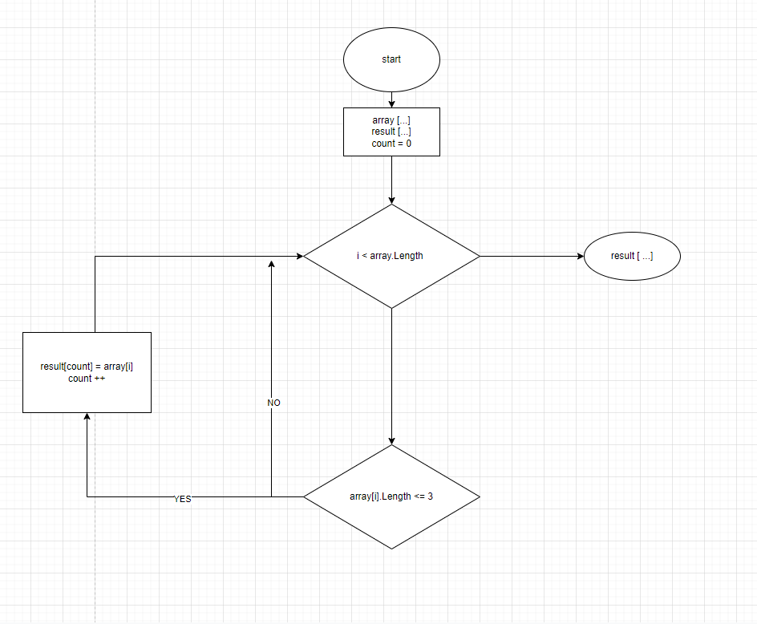

## Итоговая проверочная работа ##

1. Создать репозиторий на GigHud;

2. Нарисовать блок-смеху алгоритма;

3. Написать программу по ее решению.

*Задача:*

Написать программу, которая из имеющегося массива строк формирует массив из строк, длина которых меньше либо равна 3 символа.
Первоначальный массив можно ввести с клавиатуры, либо задать на старте выполнения алгоритма.

*Примеры:*

["hello", "2", "world", ":-)"]

["1234", "1567", "-2", "computer science"]

["Russia", "Denmark", "Kazan"]

**Описание алгоритма решения задачи:**

* Инициализируем изначально массив. Далее объявляется второй такой же длины.

* Инициализируем вспомогоательную переменную count = 0, в которую запишем количество строк, длина которых меньше либо равна 3 символа.

* Потом циклом for проходим по каждой строке массива. Внутри цикла проверка условия (строка <=3 ), если ДА элемент первого массива заносится в  элемент второго массива, если НЕТ возвращается к циклу for.
Переменная count чтобы поочередно закидывать из первого массива во второй.

* После присвоения увеличивается переменная count на 1 и возвращается к циклу for в котором i увеличивается на 1. И так проверяется до конца.

* Выводим массив результата в консоль.

Ссылка на репозиторий  -     https://github.com/katya-prudnikova/Kontrolnaya_rabota

Блок-схема алгоритма:

